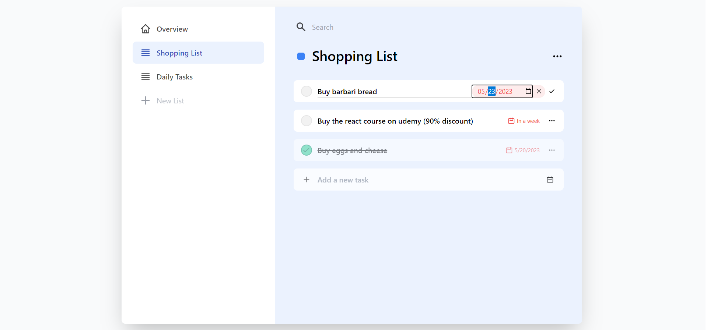

# React Todo App

React Todo Application (first sample)

## Overview


## Features
- Read and Write data to local storage
- Categorize todo items by creating, editing or deleting lists
- Add due date for todos if needed
- Show due date in a more human readable way
- Edit todo text, state and due date after creating
- Search todos

## Installation
Open your terminal and run the commands below
```
# clone project in your local machine
git clone https://github.com/alborzasd/react-todo-app-sample-01.git

# change directory to the project
cd react-todo-app-sample-01

# install required packages
npm install

# run react development server
npm start
```

## Future works
- Add ability to set persian or english calendar for due date
- Implement global state and data using redux toolkit


